## MT论坛自动签到脚本
这是一个用于自动签到MT论坛的脚本，配合 GitHub Actions 实现自动定时执行。  
详细教程可以去哔哩哔哩搜索

###### **最后更新日期：2026年02月03日 08点22分**

## 功能
- 🔐 自动签到(单账户或多账户)
- 👥 支持多账户批量处理
- ⏰ 每天自动执行签到

## 使用方法
1. fork 或者上传此项目
2. 在Actions菜单允许 `I understand my workflows, go ahead and enable them` 按钮
3. 在 GitHub 仓库的 Settings → Secrets and variables → Actions 中添加以下环境变量
   - 添加账号: 变量名`ACCOUNTS` 

     **单账号格式:**
     ```
     user:pass
     ```
     **多账号格式:**
     ```
     user1:pass1
     user2:pass2
     user3:pass3
     ```
4. 在 GitHub 仓库的 Settings → Actions → General 设置允许推送权限
5. GitHub Actions 初始手动执行检查是否有配置错误，脚本会自动每天执行,可手动执行

<p align="center">可以按照下面教程设置</p>


## 操作教程
### 设置变量
>1. 步骤一
>   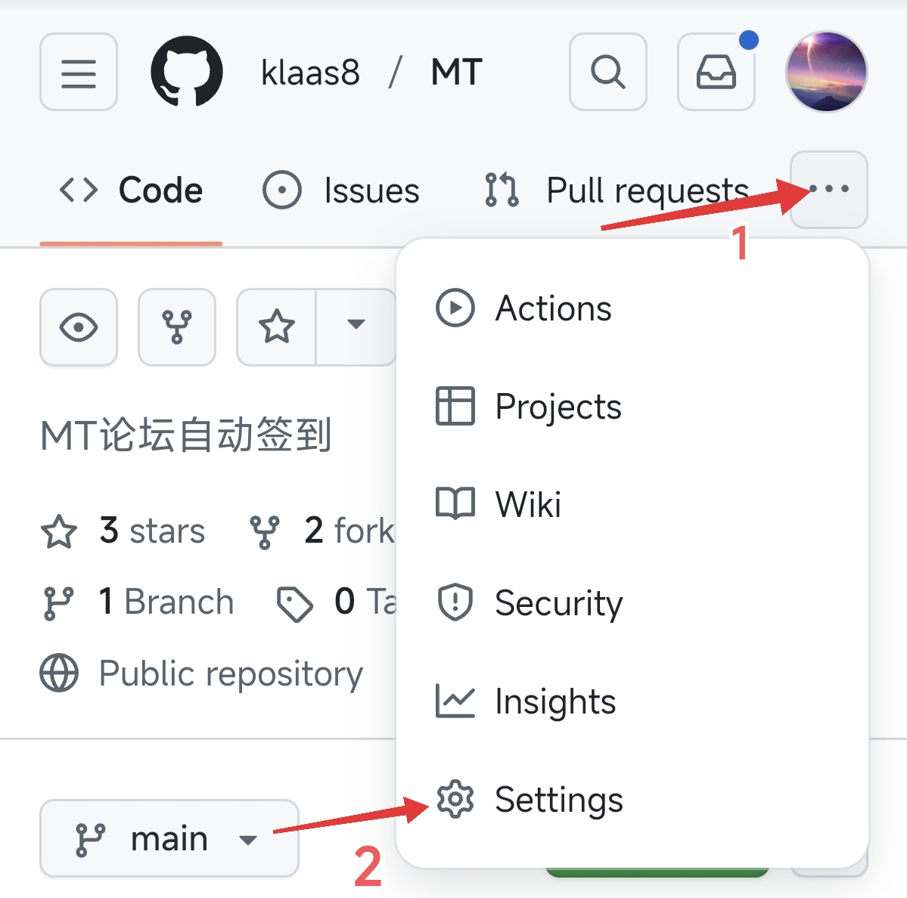
>2. 步骤二
>   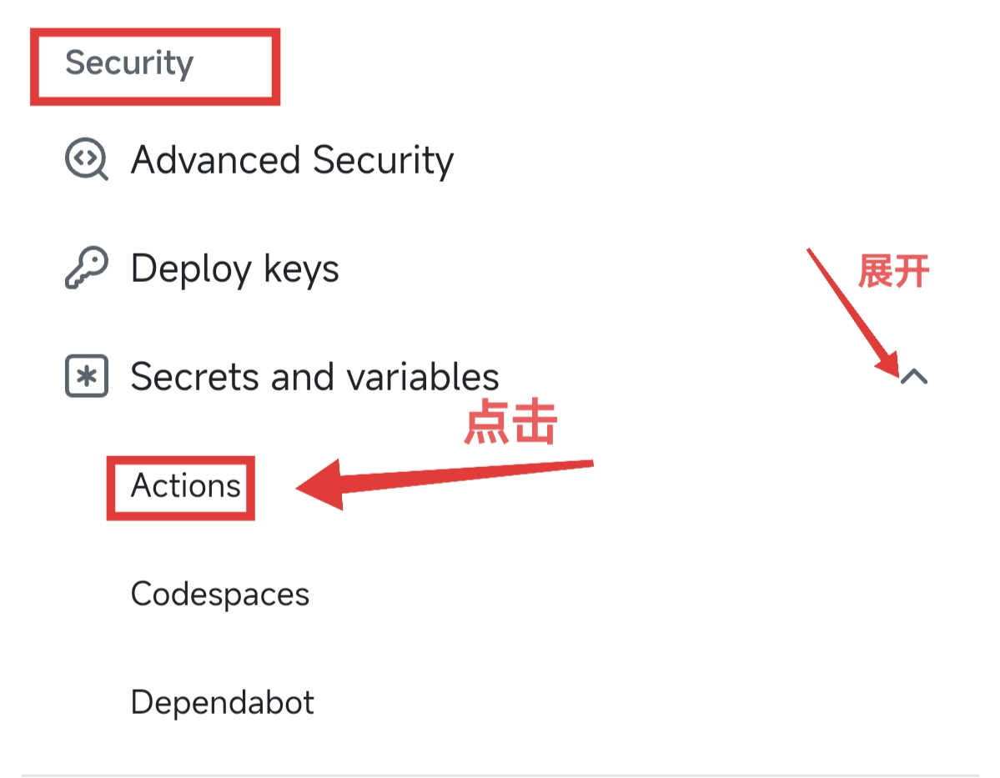
>3. 步骤三
>   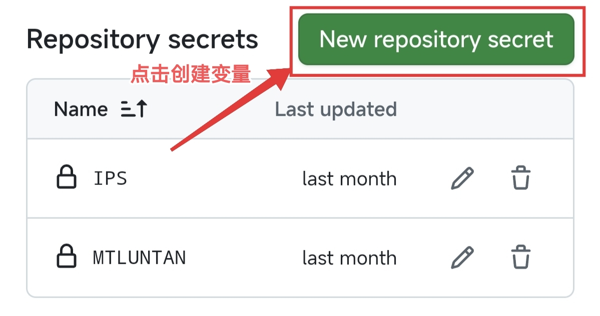
>4. 步骤四
>   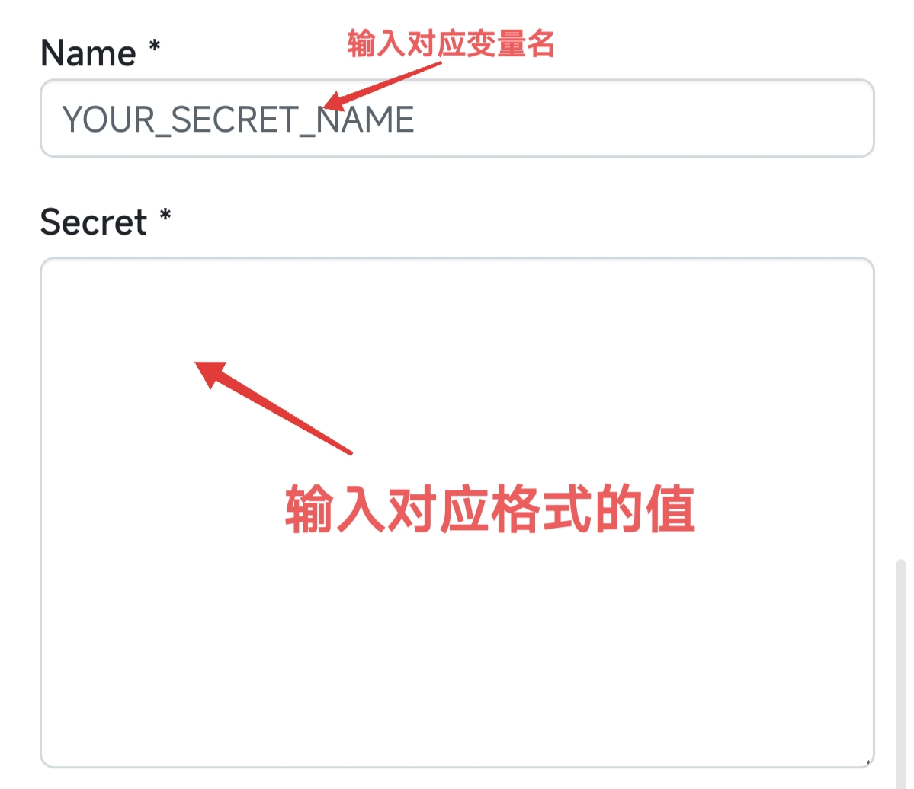

### 设置权限
>1. 步骤一
>   
>2. 步骤二
>   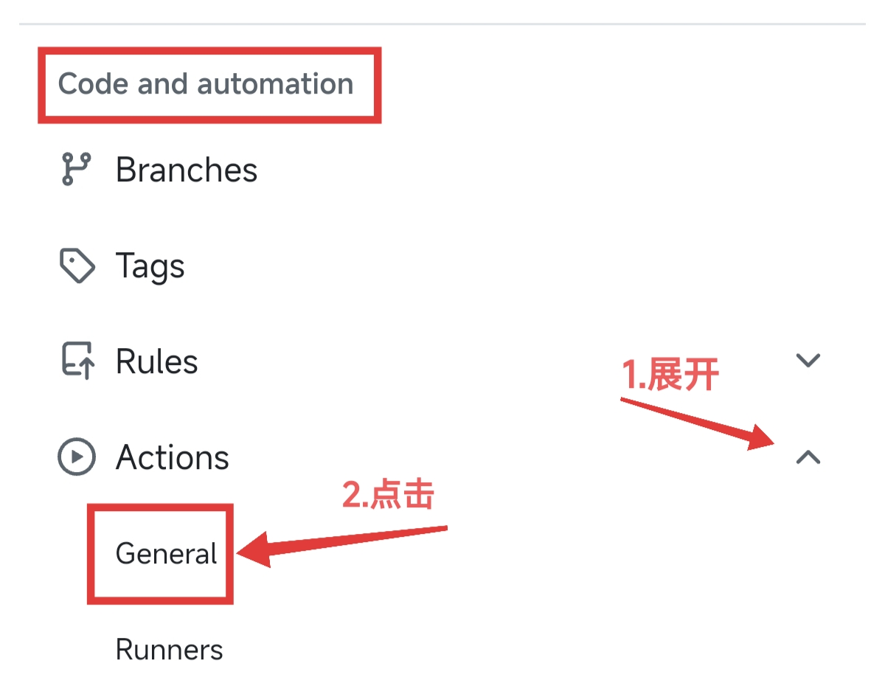
>3. 步骤三
>   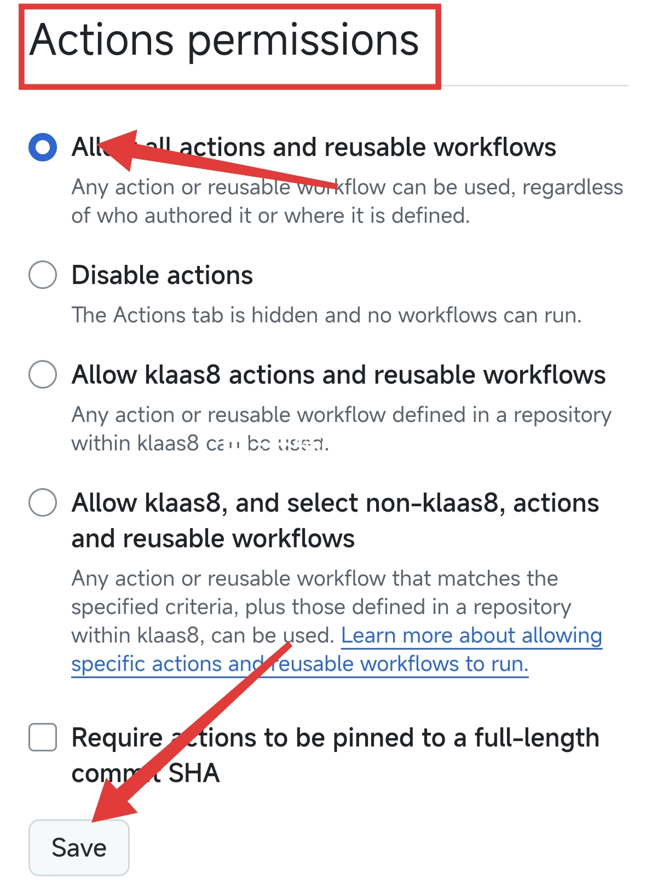
>4. 步骤四
>   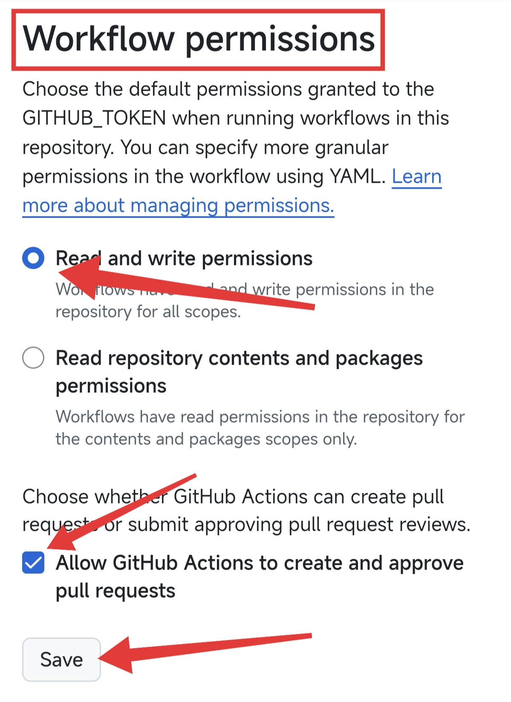

### 运行测试
>1. 步骤一
>   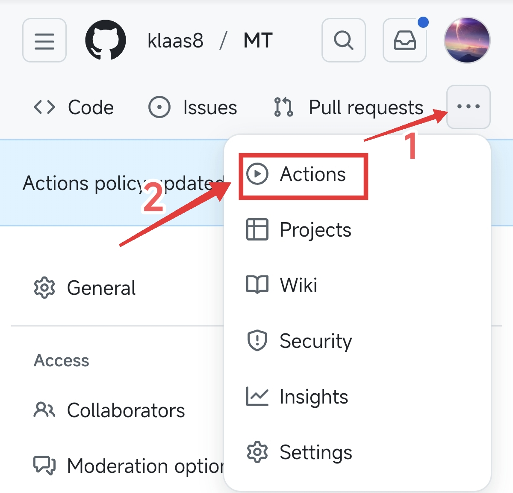
>2. 步骤二
>   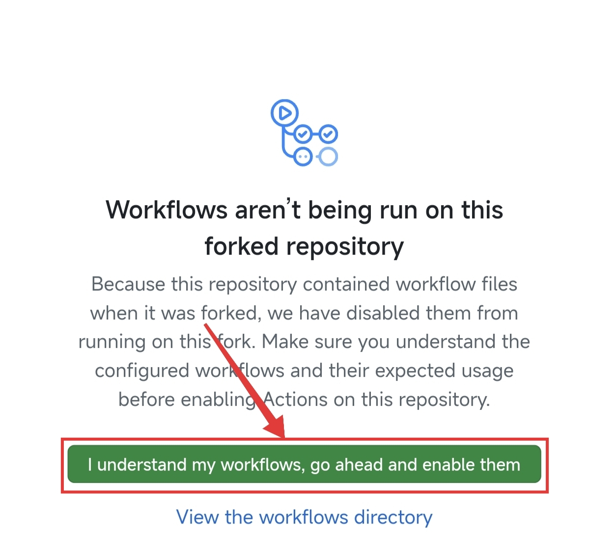
>3. 步骤三
>   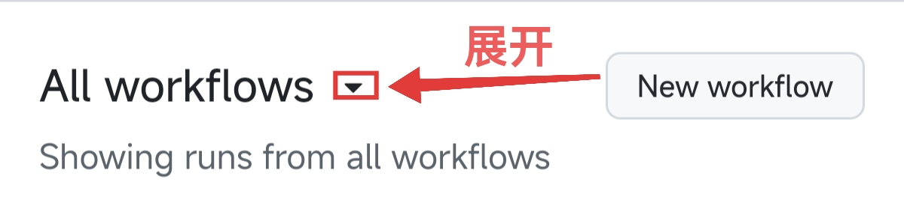
>4. 步骤四
>   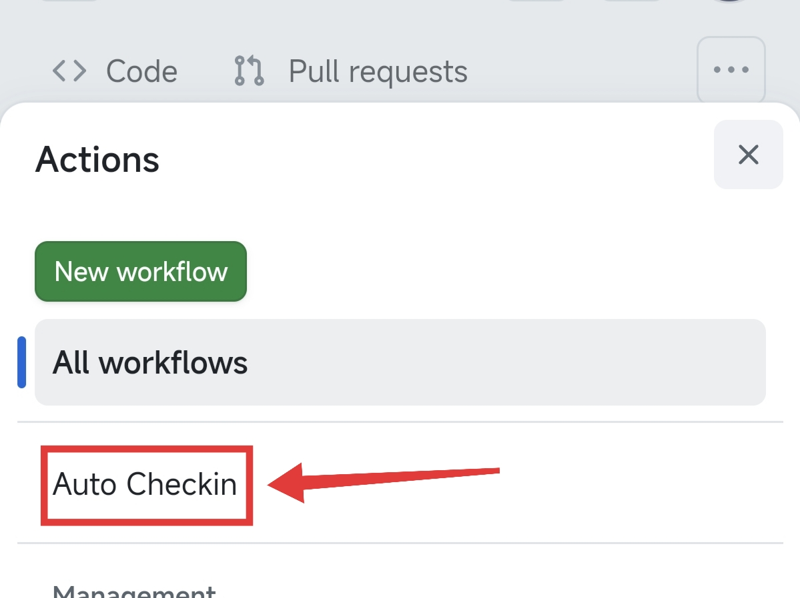
>5. 步骤五
>   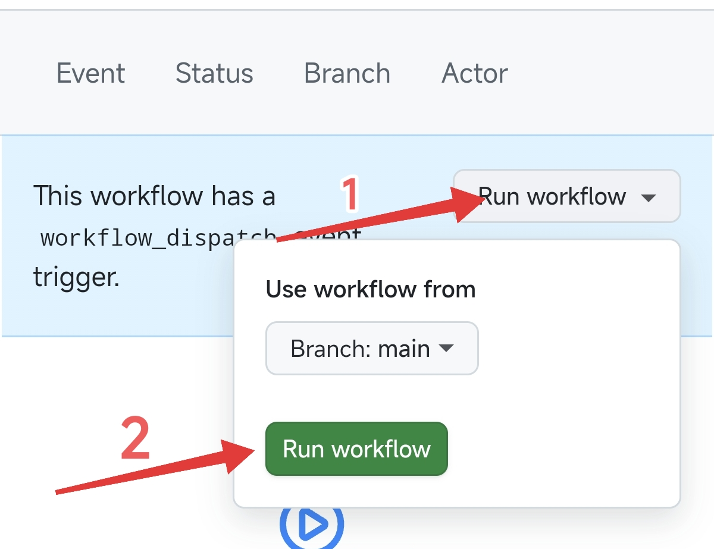

## 注意事项
1. 确保账户密码正确
2. 首次运行 GitHub Actions 需要授权
3. 脚本执行时间为 UTC 0:00（香港时间 8:00）

## 许可证
GPL 3.0
